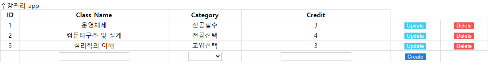
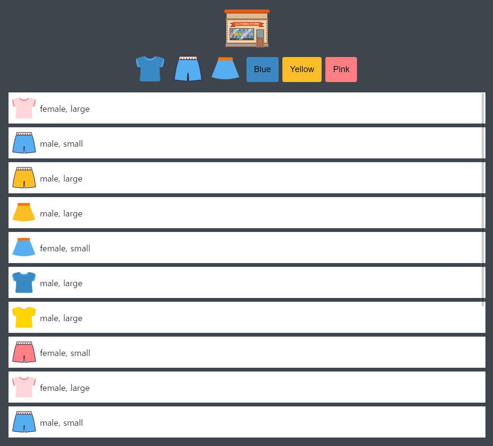
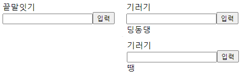
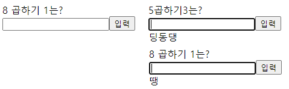
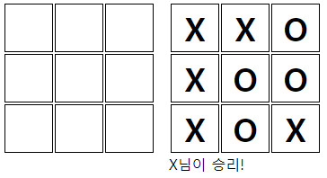
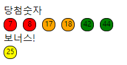
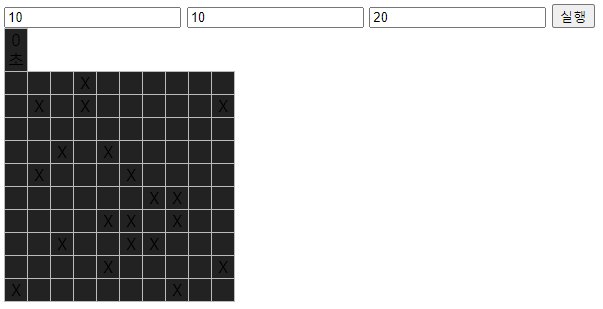

# 프로젝트명
study-ㅓavascript
> 자바스크립트 공부
---
# 구현 목록
+ games
    + [끝말잇기](https://leedokchidok19.github.io/studyJavascript/webGame/끝말잇기.html)
    + [구구단](https://leedokchidok19.github.io/studyJavascript/webGame/구구단.html)
    + [숫자야구](https://leedokchidok19.github.io/studyJavascript/webGame/숫자야구.html)
    + [틱택토](https://leedokchidok19.github.io/studyJavascript/webGame/틱택토.html)
    + [로또추첨기](https://leedokchidok19.github.io/studyJavascript/webGame/로또.html)
    + [가위바위보](https://leedokchidok19.github.io/studyJavascript/webGame/가위바위보.html)
    + [지뢰찾기](https://leedokchidok19.github.io/studyJavascript/webGame/지뢰찾기.html)
    + [반응속도](https://leedokchidok19.github.io/studyJavascript/webGame/반응속도.html)
    + [틱택토 심화](https://leedokchidok19.github.io/studyJavascript/webGame/틱택토(컴퓨터).html)
    + [짝맞추기](https://leedokchidok19.github.io/studyJavascript/webGame/짝맞추기.html)
    + [자스스톤](https://leedokchidok19.github.io/studyJavascript/webGame/자스스톤.html)
    + [2048](https://leedokchidok19.github.io/studyJavascript/webGame/2048.html)
    + [테트리스](https://leedokchidok19.github.io/studyJavascript/webGame/테트리스.html)
+ [수강 관리 APP](https://leedokchidok19.github.io/studyJavascript/study/study.html)
+ [쇼핑몰 미니게임](https://leedokchidok19.github.io/studyJavascript/miniShopping/index.html)
+ [크롬익스텐션](https://chrome.google.com/webstore/detail/clone-frequencyof/mghhkmpidmmoaofemlmnaoobgcfcgdie)
---
##### 학습 자료
+ [문법책 졸업하자! 만들면서 복습하는 JavaScript](https://edu.goorm.io/learn/lecture/25046/%EB%AC%B8%EB%B2%95%EC%B1%85-%EC%A1%B8%EC%97%85%ED%95%98%EC%9E%90-%EB%A7%8C%EB%93%A4%EB%A9%B4%EC%84%9C-%EB%B3%B5%EC%8A%B5%ED%95%98%EB%8A%94-javascript)
    + [깃허브 주소](https://github.com/kangtegong/JS-project-class/tree/master/1-Handling-HTML-With-JS)
    + [수강관리](https://leedokchidok19.github.io/studyJavascript/study/study.html)   
     
+ [자바스크립트 기초 강의 (ES5+): 같이 노트를 작성하며 배워요 📒](https://www.youtube.com/watch?v=wcsVjmHrUQg&list=PLv2d7VI9OotTVOL4QmPfvJWPJvkmv6h-2)
    + [깃허브 주소](https://github.com/dream-ellie/learn-javascript)

+ [쇼핑몰 미니게임 클론 코딩 & 코드 리뷰](https://academy.dream-coding.com/courses/mini-shopping)
    + [자바스크립트 10. JSON 개념 정리 와 활용방법 및 유용한 사이트 공유 JavaScript JSON | 프론트엔드 개발자 입문편 (JavaScript ES6)](https://www.youtube.com/watch?v=FN_D4Ihs3LE&feature=youtu.be)
    + [JavaScript Array 개념편](https://youtu.be/yOdAVDuHUKQ)
    + [JavaScript Array API 편](https://youtu.be/3CUjtKJ7PJg)
    
+ [자바스크립트 강좌](https://www.youtube.com/watch?v=Qq2IJ2iEgWA&list=PLcqDmjxt30Rtbxbh4eJREOVekql_kWVmu)
    + [깃허브 주소](https://github.com/ZeroCho/webgame-lecture)
    + 끝말잇기
           
    + 구구단
           
    + 숫자야구
        + push, pop, shift, unshift, slice, split, join, indexOf
           
    + 틱택토
        + 이차원 배열
        + e.target, parentNode
           
    + 로또추첨기
        + Array, fill
        + Array map
        + slice, sort
        + querySelector
           
    + 가위바위보
        + dictionary 자료 구조
        + object, entries, find, findIndex
        + setTimeout, clearTimeout
           
    + 지뢰찾기
        + 스코프
        + 스코프 체인
        + 렉시컬 스코프
        + 클로저
           
    + 반응속도
        + 호출 스택(call back)
        + 재귀함수
           
    + 틱택토 심화
    + 짝맞추기 게임
        + [Object.create() 추천](https://developer.mozilla.org/ko/docs/Web/JavaScript/Reference/Global_Objects/Object/create)
        + [객체의 복사](https://www.zerocho.com/category/JavaScript/post/5750d384b73ae5152792188d)
        + 팩토리패턴(비추천)
        + 프로토 타입(비추천)
    + 자스스톤
        + call by value
        + call by reference(자바스크립트에는 없습니다)
        + call by sharing
        + 생성자, new
        + [cloneNode](https://webisfree.com/2015-05-06/[%EC%9E%90%EB%B0%94%EC%8A%A4%ED%81%AC%EB%A6%BD%ED%8A%B8]-clonenode()-%ED%95%A8%EC%88%98%EB%A5%BC-%EC%82%AC%EC%9A%A9%ED%95%B4-%EB%85%B8%EB%93%9C-%EB%B3%B5%EC%A0%9C%ED%95%98%EA%B8%B0)
    + 2048
        + mousedown, mousemove, mouseup
    + 테트리스
        + switch, keyup, keydown, keypress
        + 이벤트 루프
        + var(변수-함수스코프), const(상수-블록스코프), let(변수-블록스코프)
        + [ES2015(ES6) Function(함수)](https://www.zerocho.com/category/ECMAScript/post/5759abc132522e883c6f6dda)
        + [...Array(숫자).keys()]
+ 크롬 익스텐션
    + [생활코딩](https://opentutorials.org/module/2503/14051)
    + [구글 크롬 익스텐션 문서](https://support.google.com/chrome/a/answer/2714278?hl=ko)