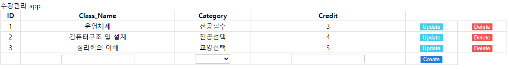

# studyJavascript
study javascript
자바스크립트 공부
---
##### 목록
+ [수강관리앱](study)
---
##### 학습 자료
+ [문법책 졸업하자! 만들면서 복습하는 JavaScript](https://edu.goorm.io/learn/lecture/25046/%EB%AC%B8%EB%B2%95%EC%B1%85-%EC%A1%B8%EC%97%85%ED%95%98%EC%9E%90-%EB%A7%8C%EB%93%A4%EB%A9%B4%EC%84%9C-%EB%B3%B5%EC%8A%B5%ED%95%98%EB%8A%94-javascript)
    + 
+ [자바스크립트 기초 강의 (ES5+): 같이 노트를 작성하며 배워요 📒](https://www.youtube.com/watch?v=wcsVjmHrUQg&list=PLv2d7VI9OotTVOL4QmPfvJWPJvkmv6h-2)
+ [자바스크립트 강좌](https://www.youtube.com/watch?v=Qq2IJ2iEgWA&list=PLcqDmjxt30Rtbxbh4eJREOVekql_kWVmu)
    + [끝말잇기](https://leedokchidok19.github.io/studyJavascript/webGame/wordChain.html)
    + [구구단](https://leedokchidok19.github.io/studyJavascript/webGame/gugudan.html)
    + [숫자야구](https://leedokchidok19.github.io/studyJavascript/webGame/numericBaseball.html)
    + [틱택토](https://leedokchidok19.github.io/studyJavascript/webGame/tictactoe.html)
+ 